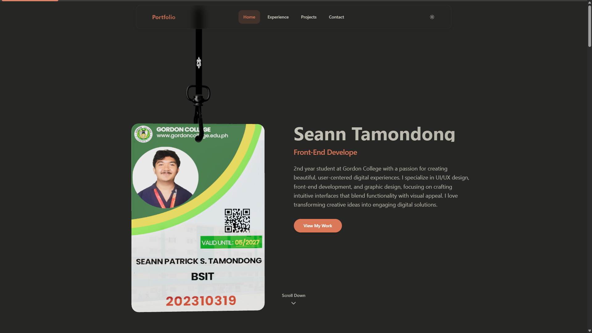

# Seann Tamondong - Portfolio 🎨



A modern, full-stack portfolio website showcasing front-end development, UI/UX design, and graphic design work. Built with TypeScript, React, and modern web technologies.

## About This Portfolio

This portfolio showcases the work of Seann Tamondong, a 2nd year student at Gordon College with a passion for creating beautiful, user-centered digital experiences. The site demonstrates expertise in UI/UX design, front-end development, and graphic design, featuring both development projects and creative work.

## Features

- **Modern Portfolio Design**: Clean, responsive design showcasing development and design work
- **Interactive Components**: Smooth animations, scroll effects, and modern UI interactions
- **Performance Optimized**: Built with performance in mind using modern optimization techniques
- **Full-Stack Architecture**: Complete monorepo structure with shared types
- **Technology Stack**:
  - [React](https://react.dev) with TypeScript for the frontend
  - [Vite](https://vitejs.dev) for fast development and building
  - [Tailwind CSS](https://tailwindcss.com) for styling
  - [Bun](https://bun.sh) as the JavaScript runtime
  - [Hono](https://hono.dev) for the backend API
  - [Three.js](https://threejs.org) for 3D graphics and animations

## Project Structure

```
.
├── client/                    # React frontend portfolio application
│   ├── public/               # Static assets and images
│   │   ├── HeroSection.png   # Hero section image
│   │   ├── Graphics/         # Design portfolio images
│   │   ├── OCPL/            # OCPL project screenshots
│   │   ├── Flow/            # Flow project screenshots
│   │   └── GC-Medmars/      # Medical records system images
│   ├── src/
│   │   ├── components/       # Reusable React components
│   │   │   ├── common/       # Common UI components
│   │   │   ├── sections/     # Page sections (Hero, About, Projects, etc.)
│   │   │   └── ui/          # Base UI components
│   │   ├── lib/             # Utilities and data
│   │   │   ├── portfolio-data.ts  # Portfolio content and data
│   │   │   ├── types.ts     # TypeScript type definitions
│   │   │   └── utils.ts     # Utility functions
│   │   ├── hooks/           # Custom React hooks
│   │   ├── styles/          # CSS and styling files
│   │   └── pages/           # Page components
├── server/                   # Hono backend API
│   └── src/
│       └── index.ts         # API server entry point
├── shared/                   # Shared TypeScript definitions
│   └── src/types/           # Type definitions used by both client and server
└── package.json             # Root package.json with workspaces
```

## Portfolio Highlights

**Featured Development Projects:**

1. **OCPL Attendance System** - A high-performance barcode-based attendance tracking system built with Electron, JavaScript, and Supabase
2. **Flow** - A web-based virtual queue management system using HTML5, PHP, SQL, CSS3, and Vue.js
3. **GC-MedMars** - A comprehensive medical records management system for Gordon College built with PHP and JavaScript

**Design & Creative Work:**
- Brand identity design and logo creation
- Digital art and abstract artwork
- UI/UX case studies and mobile app interfaces
- Motion graphics and video content
- Print design and marketing materials

## Technologies Used

**Frontend Development:**
- React with TypeScript
- Vue.js
- HTML5, CSS3, JavaScript
- Tailwind CSS
- Three.js for 3D graphics

**Backend & Tools:**
- Hono framework
- Bun runtime
- Electron for desktop applications
- PHP and SQL for web applications
- Supabase for database management

**Design Tools:**
- Figma for UI/UX design
- Adobe Photoshop for graphic design
- DaVinci Resolve for video editing
- VS Code for development

## Getting Started

### Installation

```bash
# Install dependencies for all workspaces
bun install
```

### Development

```bash
# Run shared types in watch mode, server, and client all at once
bun run dev

# Or run individual parts
bun run dev:shared  # Watch and compile shared types
bun run dev:server  # Run the Hono backend
bun run dev:client  # Run the Vite dev server for React
```

### Testing

The client includes comprehensive testing capabilities with Vitest:

```bash
# Run all tests
cd client && bun run test

# Run tests once
cd client && bun run test:run

# Run performance tests
cd client && bun run test:performance

# Type checking
cd client && bun run type-check
```

### Performance Auditing

Built-in performance monitoring and auditing tools:

```bash
# Performance audit
cd client && bun run audit:performance

# Accessibility audit
cd client && bun run audit:accessibility

# Bundle size analysis
cd client && bun run audit:bundle

# Complete audit suite
cd client && bun run audit:final

# Lighthouse performance report
cd client && bun run lighthouse
```

### Building

```bash
# Build everything
bun run build

# Or build individual parts
bun run build:shared  # Build the shared types package
bun run build:client  # Build the React frontend

# Build with bundle analysis
cd client && bun run build:analyze
```

## Contact

- **Email**: seannpatrick25@gmail.com
- **Phone**: 0931 843 7976
- **Location**: Olongapo City, Zambales
- **GitHub**: [seannywoot](https://github.com/seannywoot)
- **LinkedIn**: [Seann Patrick Tamondong](https://www.linkedin.com/in/seann-patrick-tamondong-512562377/)
- **Facebook**: [seann.patrick.tamondong](https://www.facebook.com/seann.patrick.tamondong/)

## License

This project is licensed under the MIT License - see the [LICENSE](LICENSE) file for details.

## Learn More

- [React Documentation](https://react.dev/learn)
- [Vite Documentation](https://vitejs.dev/guide/)
- [Tailwind CSS Documentation](https://tailwindcss.com/docs)
- [Bun Documentation](https://bun.sh/docs)
- [Hono Documentation](https://hono.dev/docs)
- [TypeScript Documentation](https://www.typescriptlang.org/docs/)